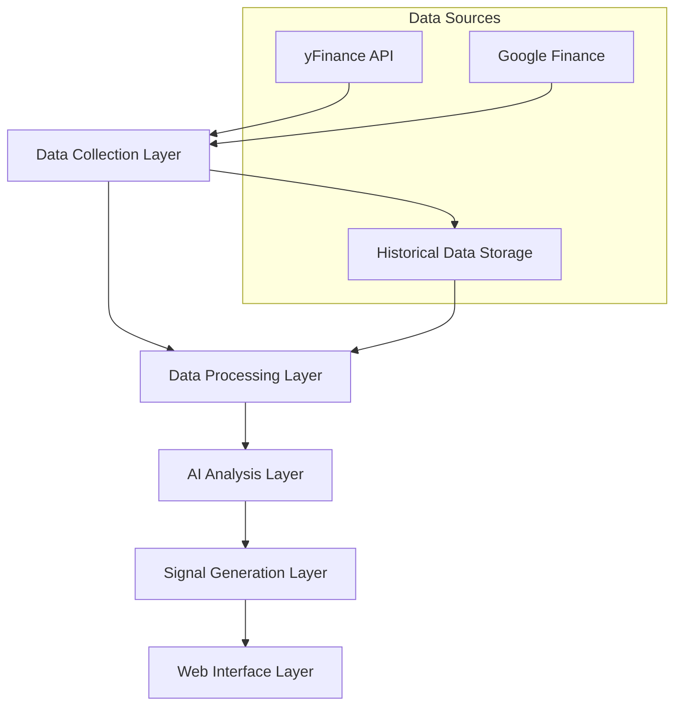
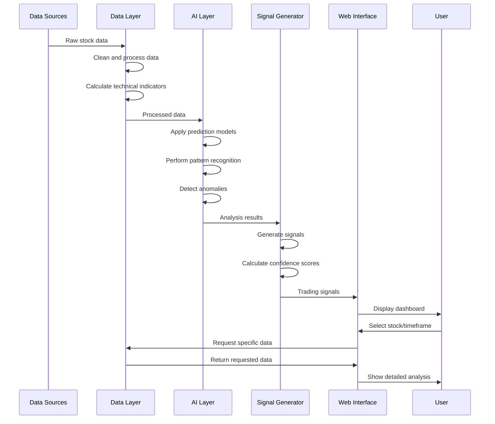

# AI-Based NSE Stock Technical Signals Web Application Plan

## 1. System Architecture

## 2. Component Breakdown

### 2.1 Data Collection Layer
- **Purpose**: Fetch financial data from yFinance and Google Finance APIs
- **Components**:
  - Stock Data Fetcher: Retrieves real-time and historical price data
  - Financial Metrics Collector: Gathers fundamental data and market metrics
  - Data Synchronization Manager: Ensures consistent data across sources
- **Technologies**: Python, yfinance library, requests/BeautifulSoup for Google Finance

### 2.2 Data Processing Layer
- **Purpose**: Clean, normalize, and prepare data for analysis
- **Components**:
  - Data Cleaner: Handles missing values and outliers
  - Feature Engineering: Creates derived features for technical analysis
  - Technical Indicator Calculator: Computes standard technical indicators
- **Technologies**: Pandas, NumPy, TA-Lib

### 2.3 AI Analysis Layer
- **Purpose**: Apply AI/ML techniques to analyze stock patterns
- **Components**:
  - Prediction Models: Time-series forecasting for price movements
  - Pattern Recognition: Identify chart patterns and formations
  - Anomaly Detection: Spot unusual market behavior
- **Technologies**: Scikit-learn, TensorFlow/Keras, Prophet, LSTM networks

### 2.4 Signal Generation Layer
- **Purpose**: Generate actionable trading signals based on AI analysis
- **Components**:
  - Signal Aggregator: Combines signals from multiple sources
  - Confidence Calculator: Assigns confidence scores to signals
  - Alert Generator: Creates notifications for significant signals
- **Technologies**: Custom Python algorithms, rule-based systems

### 2.5 Web Interface Layer
- **Purpose**: Present signals and analysis to users
- **Components**:
  - Dashboard: Visual overview of signals and market status
  - Stock Screener: Filter stocks based on signals and criteria
  - Detailed Analysis View: In-depth analysis for individual stocks
  - User Preferences: Customization options for alerts and display
- **Technologies**: Flask/FastAPI backend, React/Vue frontend, Plotly/D3.js for charts

## 3. Technical Indicators to Implement

We'll implement the most reliable technical indicators:

1. **Trend Indicators**:
   - Moving Averages (SMA, EMA, VWAP)
   - MACD (Moving Average Convergence Divergence)
   - ADX (Average Directional Index)
   - Parabolic SAR

2. **Momentum Indicators**:
   - RSI (Relative Strength Index)
   - Stochastic Oscillator
   - CCI (Commodity Channel Index)
   - Williams %R

3. **Volatility Indicators**:
   - Bollinger Bands
   - ATR (Average True Range)
   - Standard Deviation

4. **Volume Indicators**:
   - OBV (On-Balance Volume)
   - Volume Rate of Change
   - Accumulation/Distribution Line
   - Money Flow Index

## 4. AI Implementation Approach

### 4.1 Prediction Models
- **Time Series Forecasting**:
  - ARIMA/SARIMA models for short-term predictions
  - LSTM/GRU neural networks for capturing long-term dependencies
  - Prophet for trend and seasonality decomposition
- **Ensemble Methods**:
  - Combine multiple forecasting models for improved accuracy
  - Use techniques like stacking and boosting

### 4.2 Pattern Recognition
- **Candlestick Pattern Detection**:
  - CNN-based image recognition for chart patterns
  - Rule-based detection for common patterns (head and shoulders, double tops, etc.)
- **Support/Resistance Level Identification**:
  - Clustering algorithms to identify price levels
  - Fractal analysis for multi-timeframe support/resistance

### 4.3 Anomaly Detection
- **Statistical Methods**:
  - Z-score analysis for outlier detection
  - DBSCAN for identifying unusual price/volume clusters
- **Deep Learning Approaches**:
  - Autoencoders for unsupervised anomaly detection
  - Sequence models to detect unusual patterns in time series

## 5. Development Roadmap

### Phase 1: Foundation (Weeks 1-2)
- Set up project structure and environment
- Implement data collection from yFinance and Google Finance
- Create basic data processing pipeline
- Develop database schema for storing historical data

### Phase 2: Technical Analysis Engine (Weeks 3-4)
- Implement all technical indicators
- Create visualization components for indicators
- Develop backtesting framework for indicator performance

### Phase 3: AI Model Development (Weeks 5-8)
- Develop and train prediction models
- Implement pattern recognition algorithms
- Create anomaly detection systems
- Integrate all AI components

### Phase 4: Signal Generation (Weeks 9-10)
- Develop signal generation logic
- Implement confidence scoring system
- Create alert mechanism
- Test and optimize signal accuracy

### Phase 5: Web Interface (Weeks 11-14)
- Develop backend API
- Create frontend dashboard
- Implement stock screener
- Add user preference management
- Optimize performance and UX

### Phase 6: Testing and Deployment (Weeks 15-16)
- Comprehensive testing
- Performance optimization
- Deployment to production
- Documentation and user guides

## 6. Technology Stack Recommendation

### Backend
- **Language**: Python 3.9+
- **Web Framework**: FastAPI (high performance, easy API development)
- **Data Processing**: Pandas, NumPy, TA-Lib
- **Machine Learning**: Scikit-learn, TensorFlow/Keras, Prophet
- **Database**: PostgreSQL (time-series data), Redis (caching)
- **Task Queue**: Celery (for background processing)

### Frontend
- **Framework**: React with TypeScript
- **State Management**: Redux or Context API
- **Charting**: TradingView Lightweight Charts or Plotly
- **UI Components**: Material-UI or Ant Design
- **API Communication**: Axios

### DevOps
- **Containerization**: Docker
- **Orchestration**: Docker Compose (development), Kubernetes (production)
- **CI/CD**: GitHub Actions
- **Monitoring**: Prometheus, Grafana
- **Hosting**: AWS or GCP

## 7. Data Flow and Processing

## 8. Key Challenges and Considerations

1. **Data Quality and Consistency**:
   - Handling missing data points
   - Reconciling differences between data sources
   - Managing API rate limits and outages

2. **Model Accuracy and Reliability**:
   - Avoiding overfitting in prediction models
   - Balancing sensitivity and specificity in signal generation
   - Adapting to changing market conditions

3. **Performance Optimization**:
   - Efficient processing of large datasets
   - Real-time updates without overwhelming resources
   - Caching strategies for frequently accessed data

4. **Scalability**:
   - Supporting a growing number of stocks
   - Handling increased user load
   - Managing computational resources for AI models

5. **User Experience**:
   - Presenting complex information in an intuitive way
   - Providing appropriate level of detail for different user types
   - Ensuring responsive performance across devices

## 9. Future Expansion Possibilities

1. **Additional Data Sources**:
   - News sentiment analysis
   - Social media trends
   - Economic indicators

2. **Advanced AI Features**:
   - Reinforcement learning for strategy optimization
   - NLP for news and report analysis
   - Explainable AI for signal justification

3. **User Features**:
   - Custom strategy builder
   - Portfolio tracking and optimization
   - Performance analytics and reporting

4. **Integration Options**:
   - Broker API connections for automated trading
   - Export to trading platforms
   - Mobile app development